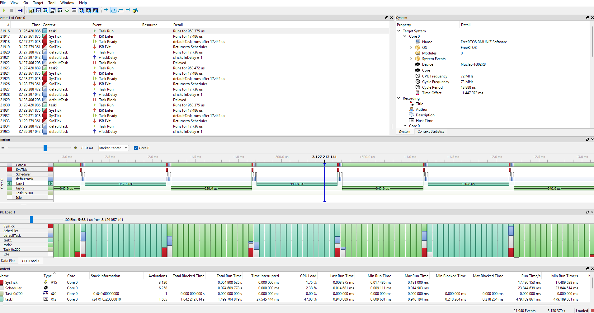

# FreeRTOS + HAL (STM32F302) com SEGGER SystemView

Projeto exemplo integrando **FreeRTOS** (via **STM32Cube HAL**) com **SEGGER SystemView** para traçar, em tempo real, **trocas de contexto**, **criação/eliminação de tasks**, **queues/semaphores/timers** e **ISRs**. Timestamp por **DWT->CYCCNT**.

---

## Vantagens

- **Visibilidade total** do escalonamento e do uso de CPU.
- **Medições precisas** (em ciclos de CPU) com baixíssima intrusão (RTT via J-Link).
- **Depuração de prioridade/latência** muito mais rápida (starvation, bloqueios, inversão de prioridade).
- Funciona **sem patch**; o patch do SEGGER é **opcional** (apenas adiciona eventos extras de kernel).

---

## Requisitos

- **STM32CubeIDE** (placa NUCLEO‑F302R8, Cortex‑M4F).
- **FreeRTOS** do Cube (port **GCC/ARM_CM4F**).
- **SEGGER SystemView** e **J‑Link**.
- Arquivos SEGGER no projeto:
  - `SEGGER_RTT.c`, `SEGGER_RTT_Syscalls_GCC.c`
  - `SEGGER_SYSVIEW.c`, `SEGGER_SYSVIEW_FreeRTOS.c`
  - `SEGGER_RTT_Conf.h`, `SEGGER_SYSVIEW_Conf.h`, `SEGGER_SYSVIEW_FreeRTOS_Conf.h`
  - **Opcional:** `SEGGER_RTT_ASM_ARMv7M.S` (ou defina `SEGGER_RTT_USE_ASM 0` no `SEGGER_RTT_Conf.h`).

---

## Alterações realizadas

### 1) `FreeRTOSConfig.h`

Adicionar **no final** do arquivo:
```c
#include "SEGGER_SYSVIEW_FreeRTOS.h"
```

Ativar as flags:
```c
#define configUSE_TRACE_FACILITY        1
#define INCLUDE_xTaskGetHandle          1
#define INCLUDE_xTaskGetIdleTaskHandle  1
#define INCLUDE_pxTaskGetStackStart     1
```

> Dicas:
> - `configPRIO_BITS = 4` (STM32F3).
> - Configure **priority grouping** sem subprioridade:
>   ```c
>   NVIC_SetPriorityGrouping(0);     // ou HAL_NVIC_SetPriorityGrouping(NVIC_PRIORITYGROUP_4)
>   // Reaplicar depois as prioridades de PendSV/SysTick/SVCall
>   ```
> - PendSV e SysTick na prioridade **mais baixa** (numérico alto).

---

### 2) `main.c` — DWT + SystemView

No topo do arquivo (após os includes):
```c
#define DWT_CTRL (*(volatile uint32_t*)0xE0001000)  // DWT->CTRL
```

**Antes do scheduler** (após `osKernelInitialize()` e **antes** de criar as tasks):
```c
// Habilita contador de ciclos (timestamp)
DWT_CTRL |= (1u << 0);

// Configura e inicia o SystemView
SEGGER_SYSVIEW_Conf();
SEGGER_SYSVIEW_Start();

// (agora crie as suas tasks) …
osKernelStart();
```

**Ordem recomendada** (para capturar “Task Create”):
```
osKernelInitialize()
→ SEGGER_SYSVIEW_Conf()
→ SEGGER_SYSVIEW_Start()
→ cria tasks
→ osKernelStart()
```

---

## Como aplicar o **patch do SEGGER** (opcional)

O SystemView funciona **sem patch**. Se quiser aplicar o patch para eventos extras no FreeRTOS:

1. Coloque o patch em:
   ```
   Middlewares/Third_Party/Segger/Patch/FreeRTOSV10_Core.patch
   ```

2. No **STM32CubeIDE** (sem EGit), crie uma ferramenta externa:

   - **Run → External Tools → External Tools Configurations… → Program → New**
     - **Name:** `Apply SEGGER patch`
     - **Location:** `C:\Program Files\Git\bin\git.exe`  *(instale Git for Windows)*
     - **Working Directory:** `${workspace_loc:/<SeuProjeto>/Middlewares/Third_Party/FreeRTOS}`
     - **Arguments:**
       ```
       apply -p1 -v "${workspace_loc:/<SeuProjeto>/Middlewares/Third_Party/Segger/Patch/FreeRTOSV10_Core.patch}"
       ```

   Crie também:
   - **Check (dry-run):**
     ```
     apply --check -p1 -v "${workspace_loc:/<SeuProjeto>/Middlewares/Third_Party/Segger/Patch/FreeRTOSV10_Core.patch}"
     ```
   - **Revert:**
     ```
     apply -R -p1 -v "${workspace_loc:/<SeuProjeto>/Middlewares/Third_Party/Segger/Patch/FreeRTOSV10_Core.patch}"
     ```

   > Se o dry‑run falhar, tente `-p0`. Em projetos Cube alguns hunks podem não casar; aplique manualmente apenas os trechos de `Source/*` e `portable/GCC/ARM_CM4F/*`.

3. **Project → Clean** e **Build**.

---

## Dicas de uso do SystemView

- Em **Recording → Event Filter**, selecione **Default/All** para ver tasks e ISRs.
- Se houver perdas de pacote RTT, aumente `BUFFER_SIZE_UP` no `SEGGER_RTT_Conf.h`.
- Gere atividade visível: reduza `vTaskDelay` ou crie duas tasks com prioridades diferentes para observar preempção.

---

## Solução de problemas

- **Só aparece Task Idle** → inicie o SystemView **antes** de criar tasks e resete os filtros.
- **Linker: `SEGGER_RTT_ASM_WriteSkipNoLock` indefinido** → adicione `SEGGER_RTT_ASM_ARMv7M.S` **ou** `#define SEGGER_RTT_USE_ASM 0`.
- **Assert em `vPortValidateInterruptPriority`** → `NVIC_SetPriorityGrouping(0)` e reconfigure PendSV/SysTick/SVCall depois.
- **HardFault ao iniciar scheduler** → confira port **ARM_CM4F**, FPU habilitada (`CPACR`), `VTOR`, e existência de pelo menos 1 task criada com sucesso.

---

## Imagem System SystemView



## Licenças

- FreeRTOS Kernel V10.x — MIT (Amazon).
- STM32Cube HAL — STMicroelectronics.
- SEGGER SystemView/RTT — SEGGER Microcontroller GmbH.
